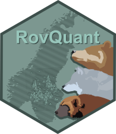

<!-- README.md is generated from README.Rmd. Please edit that file -->

# rovquantR <a href="https://www.nmbu.no/en/research/projects/rovquant"></a>

<h4 align="center">
A user-friendly interface to reproduce RovQuant’s analyses.
</h4>
<!-- badges: start -->
<p align="center">
<a href="https://github.com/PierreDupont/rovquantR/commits/master">

<a href="https://github.com/PierreDupont/rovquantR/issues">

<a href="https://github.com/PierreDupont/rovquantR/pulls">

</p>
<!-- badges: end -->
<!-- <p align="center"> -->
<!--   <a href="#installation">Installation</a> • -->
<!--   <a href="#example">Example</a> • -->
<!--   <a href="#goodrm">Good Readme</a>  -->
<!-- </p> -->

------------------------------------------------------------------------

The goal of **rovquantR** is to provide user-friendly `R` and `nimble`
functions to facilitate the reproduction of SCR and OPSCR analyses of
the Scandinavian large carnivore monitoring data originally performed by
the [Applied Quantitative Ecology Group
(AQEG)](https://www.nmbu.no/en/research/groups/applied-quantitative-ecology-group-aqeg)
during project
[RovQuant](https://www.nmbu.no/forside/en/projects/rovquant).

This package represents a collaborative effort between the `nimble`
development team and Project RovQuant.

## Installation

You can install the development version of **rovquantR** from
[GitHub](https://github.com/) with:

``` r
# install.packages("devtools")
devtools::install_github("PierreDupont/rovquantR")
```

## Example

This is a basic example which shows you how to solve a common problem:

``` r
library(rovquantR)
## basic example code
```

## Good Readme

What is special about using `README.Rmd` instead of just `README.md`?
You can include R chunks like so:

``` r
summary(cars)
#>      speed           dist       
#>  Min.   : 4.0   Min.   :  2.00  
#>  1st Qu.:12.0   1st Qu.: 26.00  
#>  Median :15.0   Median : 36.00  
#>  Mean   :15.4   Mean   : 42.98  
#>  3rd Qu.:19.0   3rd Qu.: 56.00  
#>  Max.   :25.0   Max.   :120.00
```

You’ll still need to render `README.Rmd` regularly, to keep `README.md`
up-to-date. `devtools::build_readme()` is handy for this.

You can also embed plots, for example:


In that case, don’t forget to commit and push the resulting figure
files, so they display on GitHub and CRAN.
